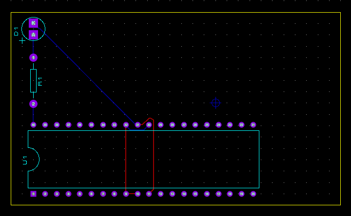
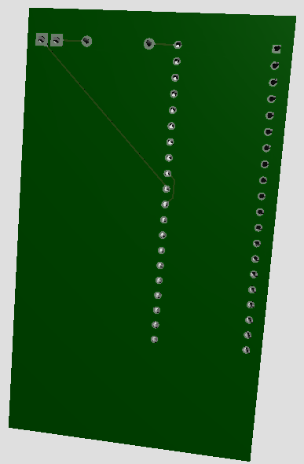

# ⚡ ATmega32 LED Blinker – Proteus PCB Project

> A simple Proteus project demonstrating LED blinking using an ATmega32 microcontroller. It sets PA0 high and low with a 300ms delay in a loop, toggling a white LED through a 200Ω resistor.

---

## 🧩 Project Files

| File | Description |
|------|-------------|
| `Project.PDSPRJ` | Full Proteus project (includes schematic + PCB layout) |
| `Schematic.DSN` | Optional standalone schematic file |
| `images/` | Screenshots of schematic, PCB layout, 3D view |
| `simulation.mp4` | Short video of LED blinking |
| `README.md` | This file |

---

## 🛠️ Components Used

| Component | Value |
|-----------|--------|
| ATmega32 | – |
| Resistor | 200Ω |
| LED | White |
| VCC | 5V |
| Crystal (Optional) | Internal or 8MHz external |

---

## 💡 Function

The firmware toggles **PA0** every 300 milliseconds to blink the LED. The blinking is continuous as long as power is supplied.

---

## 🖼️ Screenshots

  
  

![3D View (images/3D_view_top.png)]

---

## 🎞️ Simulation

[Simulation Video](simulation.mp4)

---

## 📌 Author

**Generalissimo**  
2025  
Built as part of PCB design training
